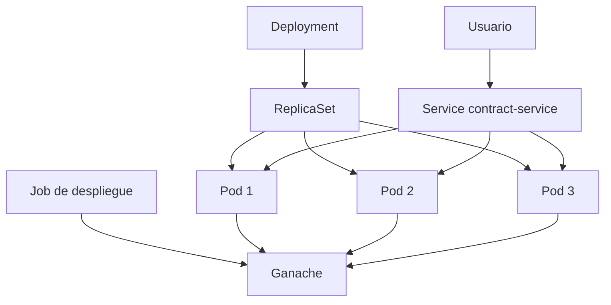
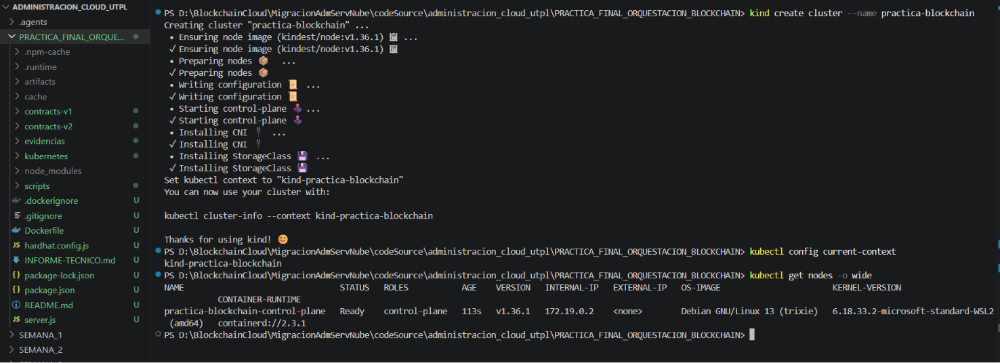
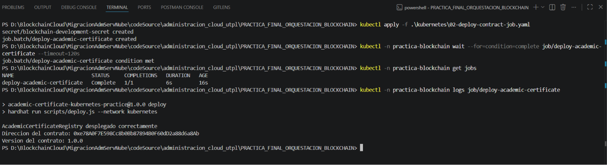
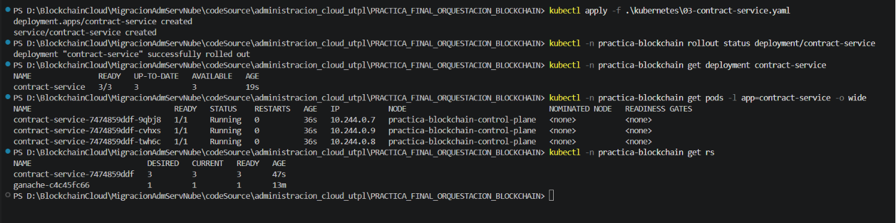
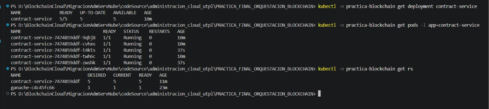
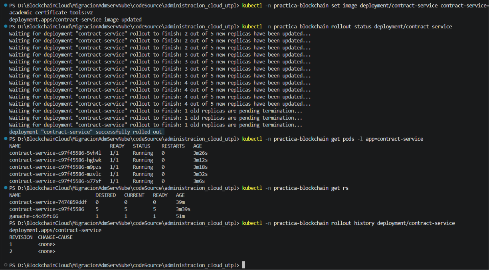
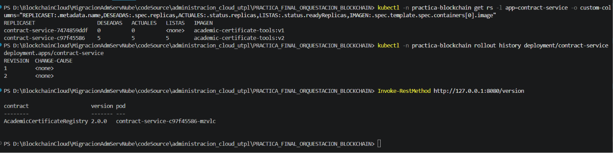
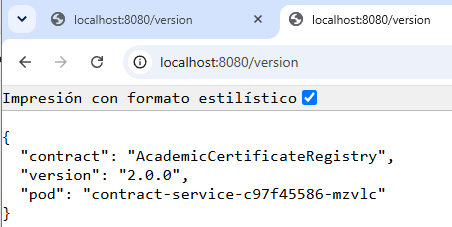

# Informe Práctica: Orquestación de Blockchain utilizando Kubernetes

## Datos generales

- Estudiante: **Byron Giovanny Cholca**
- Asignatura: **MIGRACION Y ADMINISTRACIÓN DE SERVICIOS**
- Docente: **Jonathan Rosero**
- Práctica: **Orquestación de blockchain utilizando Kubernetes**


## 1. Objetivo

Implementar la orquestación de un contenedor que incluye un smart contract y
herramientas blockchain, utilizando un Deployment de Kubernetes con tres
réplicas, un Job de despliegue, escalamiento en caliente y actualización
gradual de la imagen.

## 2. Descripción del smart contract

`AcademicCertificateRegistry` representa parte de la arquitectura propuesta
para la emisión y validación de certificados académicos digitales del
Instituto Universitario Japón.

El contrato registra el identificador y el hash de un certificado, además del
programa académico, tipo de certificado, fecha, estado y cuenta emisora. El
documento completo permanece fuera de blockchain.

Funciones principales:

- `issueCertificate`: registra un certificado nuevo.
- `getCertificate`: consulta un certificado.
- `validateCertificate`: comprueba existencia, estado y coincidencia del hash.
- `revokeCertificate`: cambia definitivamente el estado a revocado.
- `certificateExists`: consulta si el identificador está registrado.
- `version`: devuelve la versión del contrato.

La versión 2 agrega la función `institution` e identifica explícitamente al
Instituto Universitario Japón.

## 3. Arquitectura



El Job despliega el contrato una sola vez. El Deployment administra las
instancias del contenedor y el Service ofrece un punto estable de acceso.

## 4. Procedimiento y evidencias

### 4.1 Creación del clúster

Comandos ejecutados:

```powershell
kind create cluster --name practica-blockchain
kubectl get nodes
```

**Figura 1. Clúster Kind activo.**



Descripción del resultado: **Se creó el clúster local practica-blockchain mediante Kind. El nodo se presentó en estado Ready, confirmando la disponibilidad del plano de control Kubernetes.**

### 4.2 Despliegue de Ganache y del smart contract

Comandos ejecutados:

```powershell
kubectl apply -f .\kubernetes\00-namespace.yaml
kubectl apply -f .\kubernetes\01-ganache.yaml
kubectl apply -f .\kubernetes\02-deploy-contract-job.yaml
kubectl -n practica-blockchain logs job/deploy-academic-certificate
```

**Figura 2. Job y dirección del contrato desplegado.**



Dirección obtenida: **0xe78A0F7E598Cc8b0Bb87894B0F60dD2a88d6a8Ab**

El Job ejecutó Hardhat dentro de un Pod y desplegó una sola instancia del contrato AcademicCertificateRegistry en Ganache. El proceso finalizó correctamente y devolvió la dirección blockchain del contrato.

### 4.3 Estado inicial con tres réplicas

```powershell
kubectl apply -f .\kubernetes\03-contract-service.yaml
kubectl -n practica-blockchain rollout status deployment/contract-service
kubectl -n practica-blockchain get pods
kubectl -n practica-blockchain get rs
```

**Figura 3. Tres réplicas iniciales.**



Descripción del resultado: **El Deployment creó automáticamente un ReplicaSet con tres réplicas. Los tres Pods alcanzaron el estado Running y Ready, cumpliendo la configuración inicial solicitada.**

### 4.4 Primer cambio: escalamiento a cinco réplicas

```powershell
kubectl -n practica-blockchain scale deployment/contract-service --replicas=5
kubectl -n practica-blockchain get pods
kubectl -n practica-blockchain get rs
```

**Figura 4. Escalamiento a cinco réplicas.**



Descripción del resultado: **El Deployment fue escalado en caliente de tres a cinco réplicas. Kubernetes creó dos Pods adicionales sin eliminar las instancias existentes ni interrumpir el Service.**

### 4.5 Segundo cambio: rolling update

```powershell
kubectl -n practica-blockchain set image deployment/contract-service contract-service=academic-certificate-tools:v2
kubectl -n practica-blockchain rollout status deployment/contract-service
kubectl -n practica-blockchain get pods
kubectl -n practica-blockchain get rs
kubectl -n practica-blockchain rollout history deployment/contract-service
```

**Figura 5. Rolling update de V1 a V2.**



**Figura 6. Historial de ReplicaSets.**



Descripción del resultado: **El historial mostró dos ReplicaSets. El ReplicaSet correspondiente a la versión V1 quedó con cero réplicas, mientras que el ReplicaSet de la versión V2 mantuvo cinco réplicas disponibles. La consulta realizada mediante el Service devolvió la versión 2.0.0, confirmando que el rolling update finalizó correctamente.**


## 5. Validación de la versión V2 mediante el Service de Kubernetes.
Validación de la versión V2 mediante el Service de Kubernetes.

La consulta desde el navegador al endpoint /version devolvió la versión 2.0.0 y el nombre del Pod que atendió la solicitud, confirmando la disponibilidad del servicio después del rolling update.

**Figura 7. Endpoint desde el navegador.**




## 6. Resultados

- Réplicas iniciales disponibles: **3/3**.
- Réplicas después del escalamiento: **5/5**.
- Versión inicial: **1.0.0**.
- Versión posterior al rolling update: **2.0.0**.
- Interrupciones observadas: **Se requiere al menos 10GB de espacio en disco para esta práctica**.

## 7. Conclusiones

Kubernetes permitió administrar múltiples réplicas del contenedor que contiene
el smart contract y sus herramientas. El ReplicaSet mantuvo el número deseado
de Pods, mientras que el escalamiento incrementó las instancias de tres a
cinco. El rolling update sustituyó gradualmente la versión 1 por la versión 2,
manteniendo la disponibilidad del Service. El Job evitó que cada réplica
desplegara una copia diferente del contrato.
